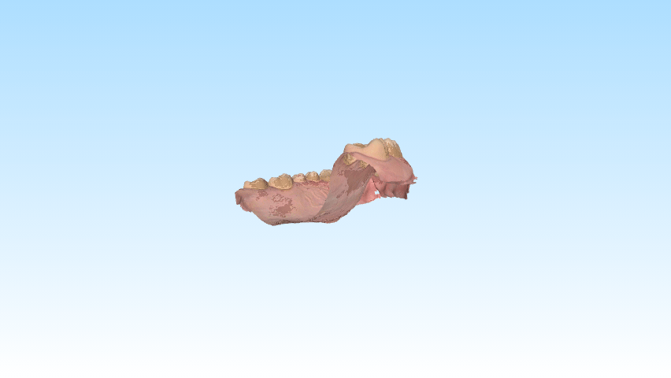

# Table of contents (GitHub)
## Quick overview:
* "Data" contains the data we initially started out with, CSV files and png files. - Folder primarily used for training and testing models
* "Overbite" This folder contains the code used for training, testing, search refinement and overbite classification along with the outputs
* "Pipeline" This folder "showcases" the workflow, so going from .PLY file to a keypoint placement

## 1. Data - Folder - Contains our data (CSV + PNG)

#### 1.1 Clean Data - Folder - Contains the formatted data
##### 1.1.1 Bolton Data - Folder - Contains images for bolton analysis
##### 1.1.2 Overbite Data - Folder - Contains images for Overbite detection
###### 1.1.2.1 Annotated Data Pairs - Folder - Contains images for training the model
###### 1.1.2.2 Annotated Data Verication Pairs - Folder - Contains images for verification during training
###### 1.1.2.3 Unannotated Data Pairs - Folder - Contains the images without annotations
###### 1.1.2.4 Annotated Data Verication Pairs - Folder - Contains images for testing after training

#### 1.2 Raw Data - Folder - Contains the raw data we started out with
###### 1.2.1 Sample images - Folder - Contains the original images

#### 1.3 Splitting_and_flipping_of_images.ipynb - Jupyter notebook file - This file does our dataprocessing

## 2. Overbite
#### 2.1 Kode - Folder - Contains the code used for training and testing
#### 2.2 Output - Folder - Different outputs from the model (Images, csv files plots)
#### 2.3 Other Versions (Overbite) - Folder - Contains "kode" and "Output" folders, but for different models

## 3. Pipeline
#### 3.1 Pipeline_code - Folder - Contains the .py files used in the pipeline.ipynb file
#### 3.2 Pipeline_data - Folder - Contains the "data" so .PLY files, PNG files and the outputs
#### 3.3 dock - Folder - Contains the "data" so .PLY files, PNG files and the outputs

# Projektbeskrivelse

## Indholsfortegnelse

##### Abstract
##### Introduktion
##### Data og databehandling
##### CNN-netværk
##### Resultater
##### Pipeline

## Abstract

## Introduction
Vi har fået til opgave at automatisere processen for overbidsklassificering.\
Som det er lige nu er der i tandlægepraksissen ikke en standardiseret metode, eller automatiseret metode for at undersøge en patients overbid. Nogle praksisser tager den på øjemål, nogle med en lineal, andre et røntenfotografi hvorfra det udregnes og nogle tager 3D scanninger af tænderne, og kan så udregne det derfra.\
Der er altså mange forskellige metoder, som alle har sine fordele og ulemper, nogle er mere præcise, men også mere tidskrævende andre er hurtigere men mere upræcise. Kan man standardisere og automatisere denne process, er der altså potentiale for både mere præcise målinger og tidsbesparelser.

Vi har i dette projekt haft 2 primære fokusområder:
1. Trænet maskinlæringsmodeller på forskellige måder, for at opnå den mest præcise model.
2. Udarbejdet et "proof of concept" Hvor vi går fra 3D filer af tænderne, til at have markeret hvor man skal måle overbiddet. Dette kan der læses mere om under sektionen "Pipeline".

Resten af projektbeskrivelsen refferere kun til fokusområde 1, fokusområde 2 vil kun blive omtalt i pipeline sektionen

## Data og databehandling

#### Databehandling

Vores projekt er startet med at vi har fået givet 1351 billeder på følgende form:

###### Billede af underkæbe fra 3 vinkler.

Til de 1351 billeder er der fulgt 1166 annoteringer med, følgende er et udsnit:

| Filename                       | X1  | Y1  | X2   | Y2  |
|---------------------------------|-----|-----|------|-----|
| 00OMSZGW_lower_combined.png     | 777 | 492 | 2310 | 487 |

Målet med vores databehandling er så følgende:

1. Få delt de kombinerede billeder op i 3 forskellige billeder
2. Del billeder op i 2 mapper; "Bolton Data" og "Overbite Data"
3. Sørg for billederne i "Overbite Data" vender ens samtidig med koordinaterne til annoteringen følger med evt. rotationer eller transponeringer
4. Gruper data efter par
5. Gruper data efter træning/test/verificering/uannoteret-data

<b> Step 1: </b>

<b> Step 2: </b>

Vi tager nu lower left og lower right billedet og rykker ind i mappen "Overbite Data", det sidste billede rykkes i mappen "Bolton Data"

<b> Step 3: </b>

Vi transponerer nu "left" billedet så orienteringen mellem left og right er ens, samtidigt med at vi transpoterer x koordinatet for "left" billedet

Vores keypoint/koordinater er markeret med rød og vi har nu en csv fil med punkter på følgende form:

| Filename                       | X1  | Y1  |
|---------------------------------|-----|-----|
| 00OMSZGW_lower_right.png     | 777 | 492 |
| 00OMSZGW_lower_left.png    | 761 | 487 |

X2 = 2310 fra 00OMSZGW_lower_combined.png er altså blevet til X1 = 761 for 00OMSZGW_lower_left\
Fordi x' = w - 1  - x, hvor w = 3072 (Bredden af 00OMSZGW_lower_combined) og x = X2\
x' = 3072 - 1 - 2310 = 761

<b> Step 4+5: </b>

Vi undersøger nu dataen for "par". Vi har et par når vi har 4 billeder med 4 annoteringer for en patient. Det vil sige har vi både left/right for overkæben og underkæben, med koordinater for alle 4 punkter, så har vi et gyldigt par.\
Alle patienter der ikke har kunnet danne et "par" bliver rykket i mappen "Unannotated Data Pairs". De resterende patienter er blevet indelt i 3 grupper; "Annotated Data Pairs", "Annotated Test data" og "Annotated Verication data".\
"Annotated Data Pairs" er den mappe der indeholder de billeder der bliver brugt under træning.\
"Annotated Verication data" er den mappe der indeholder de billeder der bliver brugt til at køre verifikation under træning.\
"Annotated Test data" er den mappe der indeholder de billeder der bliver brugt til at teste modellen efter træning er kørt.

Efter overstående har vi tjekket den nye csv fil for evt. outliers eller andre fejl, og derefter rettet evt. småfejl der kunne være.

Alt databehandling er udført med filen "Splitting_and_flipping_of_images.ipynb" som kan findes inde i "Data" mappen

#### Data
Dataen er nu fordelt på følgende mapper:

| Folder                       | Image count  |
|---------------------------------|-----|
| Bolton Data     | 1351 |
| Overbite Data   | 2702 |
| Overbite Data/Annotated Data Pairs   | 1580 |
| Overbite Data/Annotated Verication data   | 100 |
| Overbite Data/Annotated Test data   | 300 |
| Overbite Data/Unannotated Data Pairs   | 722 |

###### GIF af en 3D model af en overkæbe.