# Overbidsklassificering — Automatisering og standardisering  
*Et maskinlæringsprojekt til klassificering af overbid ud fra 3D-scanninger og billeder.*

---

## Indholdsfortegnelse 

- [Hurtigt Overblik](#hurtigt-overblik-over-filstruktur )
  - [Mappestruktur](#Mappestruktur)
- [Projektbeskrivelse](#projektbeskrivelse)
  - [Abstract](#abstract)
  - [Introduktion](#introduktion)
  - [Data og Databehandling](#data-og-databehandling)
    - [Databehandling](#databehandling)
  - [RCNN-netværk](#Keypoints-R-CNN-netværk)
  - [Pixel-matrix](#pixel-matrix)
  - [Evalueringsmetoder](#evalueringsmetoder)
  - [Resultater](#resultater)
  - [Pipeline](#pipeline)

---

## Hurtigt overblik over filstruktur

- **Data:** Indeholder alle rå og forarbejdede CSV- og PNG-filer, primært brugt til træning og test.
- **Overbite:** Indeholder kode, scripts, outputs og forskellige versioner brugt til overbite-klassificering.
- **Pipeline:** Viser hele workflowet fra 3D .PLY-fil til keypoint-placering.

---

## Mappestruktur
<details open>
  <summary>📁 Dataprojekt/</summary>
  <ul>
    <li>📄 .gitignore</li>
    <li>📄 Model.txt</li>
    <li>📄 README.md</li>
    <li>
      <details>
        <summary>📁 Data/</summary>
        <ul>
          <li>📄 pixel_flip_formula.png</li>
          <li>📄 Splitting_and_flipping_of_images.ipynb</li>
          <li>
            <details>
              <summary>📁 Clean Data/</summary>
              <ul>
                <li>
                  <details>
                    <summary>📁 Bolton Data/</summary>
                    <ul>
                      <li>📄 Example_lower_middle.png</li>
                    </ul>
                  </details>
                </li>
                <li>
                  <details>
                    <summary>📁 Overbite Data/</summary>
                    <ul>
                      <li>📄 Updated_Labels.csv</li>
                      <li>
                        <details>
                          <summary>📁 Annotated Data Pairs/</summary>
                          <ul>
                            <li>📄 Example_lower_left.png</li>
                          </ul>
                        </details>
                      </li>
                      <li>
                        <details>
                          <summary>📁 Annotated Test data/</summary>
                          <ul>
                            <li>📄 Example_lower_left.png</li>
                          </ul>
                        </details>
                      </li>
                      <li>
                        <details>
                          <summary>📁 Annotated Verication data/</summary>
                          <ul>
                            <li>📄 Example_lower_left.png</li>
                          </ul>
                        </details>
                      </li>
                      <li>
                        <details>
                          <summary>📁 Unannotated Data Pairs/</summary>
                          <ul>
                            <li>📄 Example_lower_left.png</li>
                          </ul>
                        </details>
                      </li>
                    </ul>
                  </details>
                </li>
              </ul>
            </details>
          </li>
          <li>
            <details>
              <summary>📁 Figurer/</summary>
            </details>
          </li>
          <li>
            <details>
              <summary>📁 Raw Data/</summary>
              <ul>
                <li>📄 2024-04-08 Test data for overbite classification.xlsx</li>
                <li>📄 2025-05-08 TRANSLATE_KEY(1).xlsx</li>
                <li>📄 Definitions of columns.docx</li>
                <li>📄 Labels as of 19-02-2025 (Sample images).csv</li>
                <li>📄 Labels as of 28-02-2025 (FINAL - for now).csv</li>
                <li>
                  <details>
                    <summary>📁 Sample images/</summary>
                    <ul>
                      <li>📄 Example_lower_combined.png</li>
                    </ul>
                  </details>
                </li>
              </ul>
            </details>
          </li>
        </ul>
      </details>
    </li>
    <li>
      <details>
        <summary>📁 Overbite/</summary>
        <ul>
          <li>
            <details>
              <summary>📁 Kode/</summary>
              <ul>
                <li>📄 Overbite.ipynb</li>
                <li>📄 Pixel_Matrix_Optimizer.ipynb</li>
                <li>📄 Test_Model.ipynb</li>
                <li>📄 Train_Model.ipynb</li>
              </ul>
            </details>
          </li>
          <li>
            <details>
              <summary>📁 Other Versions (Overbite)/</summary>
              <ul>
                <li>
                  <details>
                    <summary>📁 Kode/</summary>
                  </details>
                </li>
                <li>
                  <details>
                    <summary>📁 Output/</summary>
                    <ul>
                      <li>
                        <details>
                          <summary>📁 Modeller/</summary>
                        </details>
                      </li>
                      <li>
                        <details>
                          <summary>📁 Overbite Detection/</summary>
                        </details>
                      </li>
                      <li>
                        <details>
                          <summary>📁 Pixel Matrix/</summary>
                        </details>
                      </li>
                    </ul>
                  </details>
                </li>
              </ul>
            </details>
          </li>
          <li>
            <details>
              <summary>📁 Output/</summary>
              <ul>
                <li>
                  <details>
                    <summary>📁 Keypoint Placement/</summary>
                    <ul>
                      <li>📄 KP_Placement.csv</li>
                    </ul>
                  </details>
                </li>
                <li>
                  <details>
                    <summary>📁 Modeller/</summary>
                    <ul>
                      <li>📄 Model.txt</li>
                    </ul>
                  </details>
                </li>
                <li>
                  <details>
                    <summary>📁 Overbite Detection/</summary>
                    <ul>
                      <li>📄 All_FALSE_Classification_Rows.csv</li>
                      <li>📄 Overbite_Classification9.csv</li>
                      <li>📄 Results.ipynb</li>
                    </ul>
                  </details>
                </li>
                <li>
                  <details>
                    <summary>📁 Pixel Matrix/</summary>
                    <ul>
                      <li>📄 KP_Refinement.csv</li>
                      <li>📄 KP_Refinement_Distance.csv</li>
                      <li>
                        <details>
                          <summary>📁 Image Output/</summary>
                          <ul>
                            <li>📄 Example_lower_left.html</li>
                          </ul>
                        </details>
                      </li>
                    </ul>
                  </details>
                </li>
              </ul>
            </details>
          </li>
        </ul>
      </details>
    </li>
    <li>
      <details>
        <summary>📁 Pipeline/</summary>
        <ul>
          <li>📄 pipeline.ipynb</li>
          <li>📄 README.txt</li>
          <li>
            <details>
              <summary>📁 docker_detectron2_env/</summary>
              <ul>
                <li>📄 Dockerfile_pytorch3d_jupyter</li>
              </ul>
            </details>
          </li>
          <li>
            <details>
              <summary>📁 output/</summary>
              <ul>
                <li>
                  <details>
                    <summary>📁 Overbite_Model/</summary>
                    </details>
                </li>
              </ul>
            </details>
          </li>
          <li>
            <details>
              <summary>📁 Pipeline_code/</summary>
              <ul>
                <li>📄 Opdeling_og_flip_af_billeder.py</li>
                <li>📄 Overbite.py</li>
                <li>📄 Pixelmatrix.py</li>
                <li>📄 Ply_To_Image.py</li>
                <li>📄 Run_model.py</li>
              </ul>
            </details>
          </li>
          <li>
            <details>
              <summary>📁 Pipeline_data/</summary>
              <ul>
                <li>📄 patient_level_summary4.csv</li>
                <li>📄 Predicted_keypoints.csv</li>
                <li>
                  <details>
                    <summary>📁 Clean Data/</summary>
                    <ul>
                      <li>
                        <details>
                          <summary>📁 Overbite Data/</summary>
                          <ul>
                            <li>📄 Info.txt</li>
                          </ul>
                        </details>
                      </li>
                    </ul>
                  </details>
                </li>
                <li>
                  <details>
                    <summary>📁 Model/</summary>
                    <ul>
                      <li>📄 Info.txt</li>
                      <li>📄 Model.txt</li>
                    </ul>
                  </details>
                </li>
                <li>
                  <details>
                    <summary>📁 Output_after_pixel_matrix/</summary>
                    <ul>
                      <li>📄 Info.txt</li>
                    </ul>
                  </details>
                </li>
                <li>
                  <details>
                    <summary>📁 Ply Files/</summary>
                    <ul>
                      <li>📄 Brunatest LowerJawScan.ply</li>
                      <li>📄 Brunatest_UpperJawScan.ply</li>
                      <li>📄 Info.txt</li>
                    </ul>
                  </details>
                </li>
                <li>
                  <details>
                    <summary>📁 Raw_data/</summary>
                    <ul>
                      <li>📄 Brunatest LowerJawScan_0.png</li>
                      <li>📄 Brunatest LowerJawScan_1.png</li>
                      <li>📄 Brunatest_UpperJawScan_0.png</li>
                      <li>📄 Brunatest_UpperJawScan_1.png</li>
                      <li>📄 Info.txt</li>
                    </ul>
                  </details>
                </li>
              </ul>
            </details>
          </li>
        </ul>
      </details>
    </li>
  </ul>
</details>

---

# Projektbeskrivelse


---

## Abstract

Dette projekt præsenterer en automatiseret løsning til klassificering af overbid ud fra todimensionelle billeder baseret på tilhørende 3D-scanninger (IOS).
Ved at anvende Keypoint R-CNN med en ResNeXt-101 × 32d FPN-backbone trænes modellen til at lokalisere præcise keypoints i intraorale billeder. Efter den første keypoint-forudsigelse finjusteres positionerne ved hjælp af en pixel-matrix-søgning, der vælger den lyseste pixel inden for et bestemt område, hvilket reducerer fejl i punktplacering fra i gennemsnit 0,095 mm til 0,037 mm på y-aksen. Evaluering med Mean Radial Error (MRE) og Success Detection Rate (SDR) viser, at pixel-matrix justeringen halverer MRE fra omkring 0,22 mm til 0,12 mm og forbedrer SDR for næsten alle thresholds (0,5 mm, 1 mm, 2 mm) til 89 %, 96 % og 99 % henholdsvis. Patientniveau-klassificeringen af overbid i fem klasser (A–E) opnår en gennemsnitlig nøjagtighed på 95,34 % og en kvadratisk vægtet Cohen’s kappa på 0,989 på simulerede testdata. Endvidere er der udviklet en pipeline, der tager .PLY filer som input, og derigennem identificerer de punkter, hvorfra overbiddet kan måles. 


---

## Introduktion

I tandlægepraksis findes der ikke én standardiseret metode til måling af overbid. Nogle anvender øjemål, andre lineal, røntgenbilleder eller 3D-scanninger. Alle metoder har fordele og ulemper, men ofte er der en afvejning mellem præcision og tidsforbrug.

<h3>Overbid</h3>

Overbid refererer til den vertikale afstand mellem de øverste og nederste fortænder, målt fra spidsen af overkæbens fortænder til spidsen af underkæbens. Et for stort overbid indikerer, at de øverste fortænder dækker en unormalt stor del af de nederste, hvilket kan have funktionelle og æstetiske konsekvenser.
Ved at måle denne afstand kan man klassificere graden af overbid hos en patient og på den baggrund vurdere, om der er behov for behandling.
Et normalt overbid defineres typisk som en vertikal afstand på mellem 2 og 4 mm.
I dette projekt er følgende klassifikationer blevet anvendt som udgangspunkt for evaluering og test af modellen. Disse klasser er udarbejdet af vores vejledere:

<h4>Overbidsklasser</h4>

<table>
  <tr>
    <!-- First column: the table content as plain HTML rows -->
    <td>
      <table border="1">
        <tr><th>Klasse</th><th>Vertikal afstand</th></tr>
        <tr><td>A</td><td>&lt; 1 mm</td></tr>
        <tr><td>B</td><td>1–2 mm</td></tr>
        <tr><td>C</td><td>2–3 mm</td></tr>
        <tr><td>D</td><td>3–4 mm</td></tr>
        <tr><td>E</td><td>&gt; 4 mm</td></tr>
      </table>
    </td>
    <!-- Second column: the image -->
    <td style="padding-left: 30px;">
      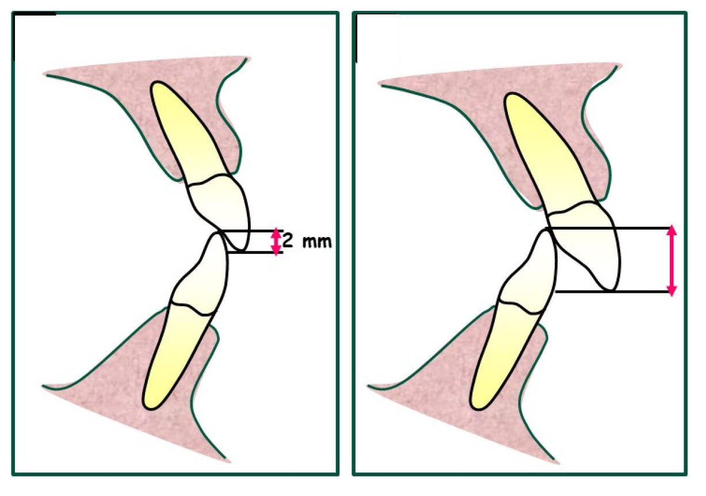
    </td>
  </tr>
</table>

> https://www.mdpi.com/2075-4426/13/10/1472 Figur 1 (03/06/2025)


**Dette projekt har to hovedfokusområder:**

1. Udvikling og træning af maskinlæringsmodeller til præcis overbidsklassificering.
2. Udarbejdelse af en pipeline, der går fra 3D-filer (.PLY) til keypoint-markering, der muliggør automatisk måling.

**Bemærk:** Resten af denne projektbeskrivelse omhandler kun punkt 1. Pipeline beskrives separat i sektionen "Pipeline".

Projektet bygger på et offentligt datasæt bestående af 1.351 tredimensionelle intraorale scanninger. Til dette projekt er 3D-scanningerne konverteret til todimensionelle billeder, hvilket gør det muligt at anvende gængse deep-learning-metoder til billedanalyse. 

Som model anvender vi Keypoint R-CNN, en videreudvikling af Mask R-CNN, der er designet til at finde præcise keypoints i billeder. Ved at kombinere regions­forslag med punktdetektion gør modellen det muligt at identificere nøjagtige punkter på tænder, hvilket er afgørende for vores opgave, da overbid måles som den vertikale afstand mellem to præcise punkter på fortænderne.

---

## Data og Databehandling

### Databehandling

Projektet startede med **1351 kombinerede billeder** (3 vinkler pr. patient):

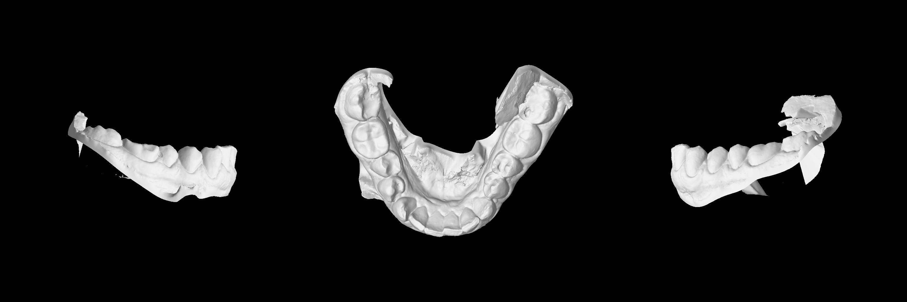

> *Billede af underkæbe fra 3 vinkler*

Til billederne var der **1166 annoteringer**, eksempelvis:

| Filename                       | X1  | Y1  | X2   | Y2  |
|---------------------------------|-----|-----|------|-----|
| 00OMSZGW_lower_combined.png     | 777 | 492 | 2310 | 487 |

#### Mål for databehandling:

1. Split kombinerede billeder til tre separate billeder (left, middle, right)
2. Fordel billeder i mapper: **Bolton Data** og **Overbite Data**
3. Ensret orientering og koordinationer i "Overbite Data" (ved transponering)
4. Gruppér data som billed-par
5. Del data i træning, test, verifikation, og uannoteret data

#### Step 1: Opdeling af billeder

<table>
  <tr>
    <td>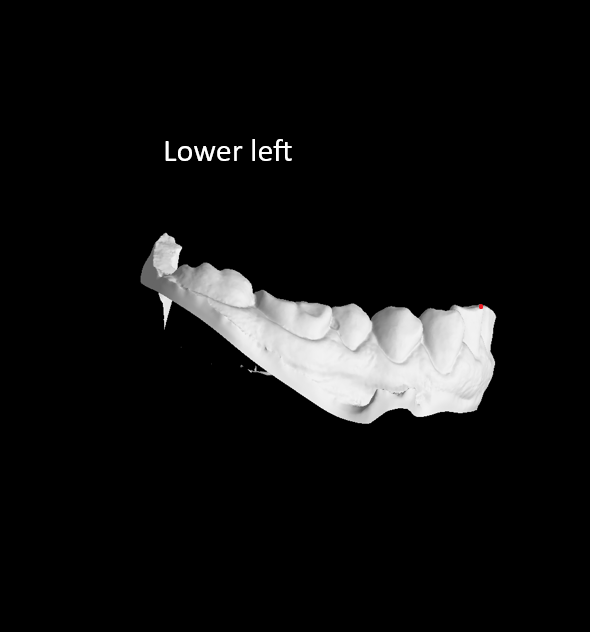</td>
    <td>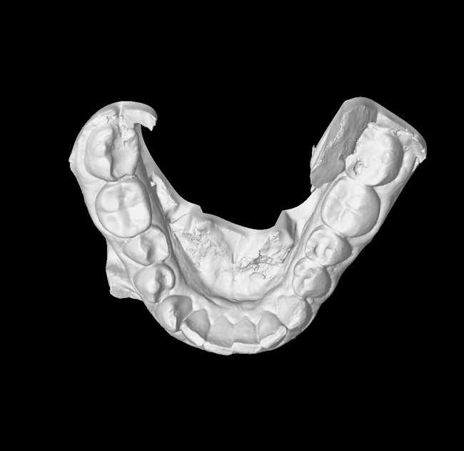</td>
    <td>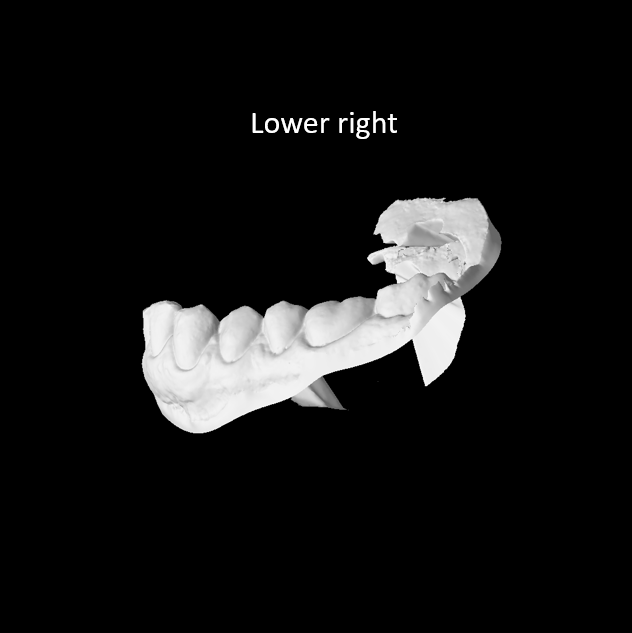</td>
  </tr>
</table>


#### Step 2: Sortering

- **Left/Right** billeder → *Overbite Data*
- **Middle** billede → *Bolton Data*

#### Step 3: Ensretning

"Right" billedet transponeres (flippes), så orienteringen matcher "Left" billedet, og koordinater justeres:\

<table>
  <tr>
    <td></td>
    <td>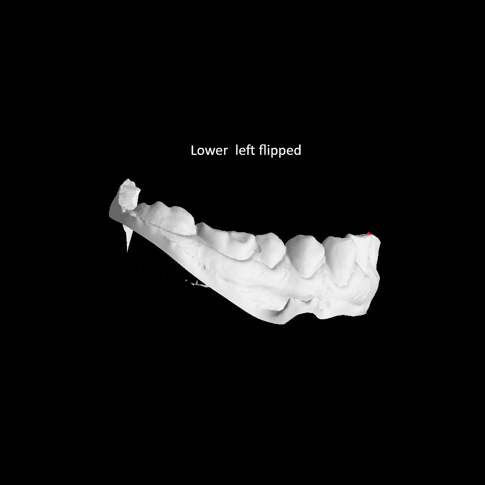</td>
  </tr>
</table>

> Keypoint/Annoteringen er markeret med rød på de 2 billeder

Koordinatet justeres så med følgende formel:
`x' = w - 1 - x`\
Her er `x = X2 = 2310` fra originalen, w = 3072 fra originalen, og derfor er det nye x beregnet til:\
`x' = 3072 - 1 - 2310 = 761`

Og den nye CSV vil derfor blive til:

| Filename                   | X1  | Y1  |
|----------------------------|-----|-----|
| 00OMSZGW_lower_left.png   | 777 | 492 |
| 00OMSZGW_lower_right.png    | 761 | 487 |


#### Step 4 + 5: Par og grupper

- Et *par* = 4 billeder med koordinater (left/right, upper/lower)
- Ufuldstændige par → *Unannotated Data Pairs*
- Resten inddeles i:
    - *Annotated Data Pairs* (træning)
    - *Annotated Verication data* (verifikation under træning)
    - *Annotated Test data* (test efter træning)

> Outliers og fejl rettes i CSV efter databehandling.  
> Alt databehandling findes i `Splitting_and_flipping_of_images.ipynb`.


---

Oversigt over fordelingen af billeder:

| Folder                               | Image count | Patient count | Annotated |
|---------------------------------------|-------------|-------------|-------------|
| Bolton Data                          | 1351        | 675 | No |
| Overbite Data                        | 2702        | 675 | NaN |
| Overbite Data/Annotated Data Pairs   | 1580        | 395 | Yes |
| Overbite Data/Annotated Verication data | 100      | 25 | Yes |
| Overbite Data/Annotated Test data    | 300         | 75 | Yes |
| Overbite Data/Unannotated Data Pairs | 722         | 180 | NaN|

Efter dataen er opdelt i mapper mangler vi kun 2 ting inden træningen kan påbegynde:

1. Opsætte en bounding boks
2. Konvertere annoteringer til "COCO JSON" format

Vi opsætter en bounding boks for at hjælpe med at lokalisere objektet af interesse. Det hjælper modellen med at finde det område den skal fokusere på, for at lave forudsigelser. Dette gør modellen mere præcis og effektiv.

Annoteringerne skal til sidst konverteres til et format som kan læses af modellen.

Modellen modtager altså som input til træning 1580 billeder af følgende format:

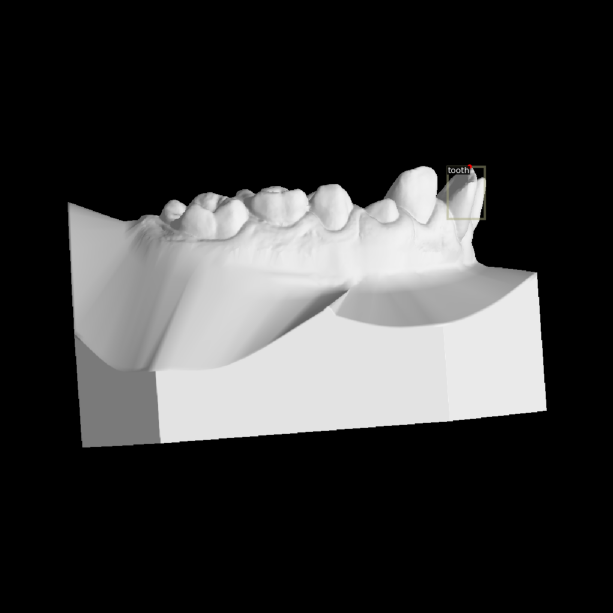

> *Keypoint markeret med rød, og bounding box markeret med grå*

Og annoteringen:

```json
{
  "images": [
    {
      "file_name": "Dataprojekt/Data/Clean Data/Overbite Data/Annotated Data Pairs/00OMSZGW_lower_left.png",
      "height": 1024,
      "width": 1024,
      "id": 0
    }
  ],
  "annotations": [
    {
      "bbox": [740, 492, 62, 125],
      "bbox_mode": 1,
      "category_id": 0,
      "keypoints": [777, 492, 2],
      "num_keypoints": 1,
      "image_id": 0,
      "id": 0
    }
  ],
  "categories": [
    {
      "id": 0,
      "name": "tooth",
      "keypoints": ["apex"],
      "skeleton": []
    }
  ]
}
```

Modellen er altså nu klar til at blive trænet.


---

## Keypoints R-CNN-netværk

I vores arbejde har vi trænet en model ved hjælp af en forudtrænet model fra Detectron2-biblioteket. Den specifikke model, vi har anvendt, er **"keypoint_rcnn_X_101_32x8d_FPN_3x"**. 

* **Modeltype:** Keypoint R-CNN. Dette indikerer, at modellen er designet til at identificere specifikke nøglepunkter (keypoints) på objekter.
* **Backbone-arkitektur:** X_101_32x8d_FPN. Dette er kernen i modellen og består af:
    * **ResNeXt-101 (X_101_32x8d):** En ResNeXt-arkitektur med 101 lag. "32x8d" specificerer, at netværket anvender 32 parallelle grupperede convolutions, hvor hver gruppe har en bredde på 8. Dette forbedrer modellens evne til at lære komplekse mønstre.
    * **FPN (Feature Pyramid Network):** Gør det muligt for modellen at lære og detektere objekter på tværs af forskellige skalaer ved at udnytte feature-maps fra flere niveauer i netværket.

### Træningsprocessen

Træningen kan grundlæggende opdeles i følgende faser:

1.  **Inputdata:**
    * Vi starter med billeder i en opløsning på 1024x1024 pixels.
    * Hvert billede er forsynet med et "ground truth" keypoint, hvilket er den korrekte, manuelt markerede placering af det ønskede nøglepunkt.

2.  **Data Augmentering:**
    * Gør modellen mere robust ved at udsætte billederne for forskellige augmenteringsteknikker.
    * Inkluderer variationer i billedstørrelse, spejlinger (horisontalt/vertikalt), samt justeringer af lys og kontrast.
    * Tilhørende annoteringer (keypoints) justeres automatisk for at matche de augmenterede billeder (f.eks. flyttes keypointet med, hvis billedet spejles).

3.  **Batch-indlæsning:**
    * Billederne indlæses i modellen i "batches" (grupper af billeder). Vi har anvendt en batch-størrelse på 16.
    * Træning med batches frem for individuelle billeder har to primære fordele:
        * **Hurtigere træning:** Parallel processering af flere billeder er mere effektivt.
        * **Mere stabil træning:** Modellens vægtjusteringer baseres på gennemsnittet af fejlen for hele batchen. Dette reducerer risikoen for, at enkelte afvigende billeder (outliers) får stor indflydelse på læringen, hvilket ville være tilfældet ved opdatering baseret på ét billede ad gangen.

4.  **Feature Extraction med ResNeXt-101:**
    * De augmenterede billeder (i batches) føres nu igennem ResNeXt-101 backbone-arkitekturen.
    * De 101 lag i netværket udfører en serie af convolution-operationer.
    * Hver convolution er yderligere opdelt i 32 grupper, som hver især specialiserer sig i at finde bestemte mønstre i billeddataene.
    * Resultatet af denne proces er en samling af "feature maps". Hver pixel i et feature map repræsenterer styrken eller tilstedeværelsen af et specifikt mønster i det oprindelige billede.

5.  **Feature Pyramid Network (FPN):**
    * FPN-komponenten tager de feature maps, der er genereret af ResNeXt-101.
    * Styrken ved FPN er, at den kombinerer feature maps fra forskellige dybder (lag) i netværket.
        * Tidlige lag fanger typisk simple, lav-niveau mønstre (kanter, teksturer).
        * Sene lag fanger mere komplekse, høj-niveau mønstre og helheder (objektdele, hele objekter).
    * Ved at samle disse informationer kan modellen bedre finde objekter og keypoints uanset deres størrelse i billedet.

6.  **Region Proposal Network (RPN):**
    * RPN modtager de kombinerede feature maps fra FPN.
    * Dens opgave er at generere tusindvis af "region proposals" – små afgrænsede bokse af forskellige størrelser og former, der dækker områder i billedet, hvor der potentielt kunne være et relevant objekt.
    * For hver af disse foreslåede bokse beregner RPN en score, der angiver sandsynligheden for, at boksen rent faktisk indeholder et objekt af interesse.
    * De mest lovende forslag (dem med højest score) sendes videre til det næste trin.

7.  **Keypoint Lokalisering:**
    * For hver af de udvalgte region proposals fra RPN genererer modellen et "heatmap", hvor hver pixelværdi repræsenterer sandsynligheden for, at det søgte keypoint befinder sig netop på dén pixelposition inden for den foreslåede region.
    * Disse sandsynligheder beregnes ved hjælp af en softmax-funktion. Softmax sikrer, at summen af alle sandsynlighederne i et heatmap er lig med 1, hvilket gør det muligt at tolke værdierne som en sandsynlighedsfordeling.
    * Til sidst identificerer modellen den pixel i heatmappet, der har den højeste sandsynlighedsværdi. Denne pixelposition betragtes som modellens endelige bud på placeringen af keypointet.

8.  **Loss, Backpropagation og Optimering:**
    Når modellen har afgivet sit bud på keypointets placering (via det genererede heatmap), er næste skridt at evaluere, hvor præcist dette bud er, og derefter justere modellen for at forbedre fremtidige forudsigelser. Denne proces involverer tre centrale elementer:

    * **Loss-beregning:**
        Først beregnes modellens fejl. Dette gøres ved at sammenligne modellens **forudsagte heatmap** med det **ground truth heatmap**. En **loss-funktion** beregner en score, der angiver, hvor stor forskellen er mellem forudsigelsen og sandheden. For denne opgave anvendes følgende loss-funktioner:

| Modul                     | Loss-funktion                                     |
|---------------------------|-------------------------------|
| **RPN - Region Proposal** | Binary Cross Entropy (BCE)                        |
|                           |                               | Smooth L1                                         |
| **ROI Box Head** | Cross Entropy (Softmax)                           |
|                           |                               | Smooth L1                                         |
| **ROI Keypoint Head** | Binary Cross Entropy (sigmoid pr. keypoint pixel) |
    
    * **Backpropagation:**
        Når fejlen (loss) er beregnet, skal vi finde ud af, hvordan hver enkelt vægt (parameter) i netværket har bidraget til denne fejl. Det er her, **backpropagation** kommer ind i billedet.
        * Processen starter med den beregnede loss-værdi.
        * Ved hjælp af **kædereglen for differentiering** beregnes gradienten af loss-funktionen med hensyn til hver vægt i netværket. Gradienten fortæller os, hvor meget loss-værdien ville ændre sig, hvis vi ændrede den pågældende vægt en lille smule – altså vægtens "ansvar" for fejlen.
        * Denne beregning foregår baglæns gennem netværket, lag for lag, fra outputlaget tilbage mod inputlaget.

    * **Optimering:**
        Med gradienterne beregnet via backpropagation ved vi nu, i hvilken "retning" hver vægt skal justeres for at reducere fejlen. En **optimeringsalgoritme** (f.eks. Adam, SGD) bruger disse gradienter til at opdatere modellens vægte.
        * Vægtene justeres typisk en lille smule i modsat retning af deres gradient. Målet er at tage et lille skridt i den retning, der minimerer loss-funktionen. Størrelsen af dette skridt styres af hyperparameteren "learning rate".

    * **Iteration og Konvergens:**
        Hele denne cyklus – data gennem modellen, loss-beregning, backpropagation, og vægtjustering – gentages for hver **batch** af billeder. Én fuld gennemgang af hele træningsdatasættet kaldes en **epoch**.
        Modellen bliver gradvist bedre (dvs. loss-værdien falder), efterhånden som dens vægte finjusteres. Træningen stoppes, når modellen **konvergerer**, hvilket betyder, at dens ydeevne på et separat valideringsdatasæt ikke længere forbedres signifikant, eller når et forudbestemt antal epochs er nået. For den valgte model stoppede vi træningen efter 152 epochs.


## Pixel-matrix

Efter modellen har placeret keypoints på billederne, finjusteres disse positioner ved hjælp af pixelsøgning. Dette sker ved at definere en matrix (af forudbestemt størrelse) omkring det keypoint, som modellen har forudsagt. Inden for denne matrix identificeres den pixel, der ligger højest og er lysest, og denne pixel vælges herefter som det nye, justerede keypoint. Hvis der findes to pixels med samme værdi, bliver den pixel, der ligger længst til venstre, valgt. Dette valg bygger på hvordan det sande keypoint bliver annoteret. 
Formålet med denne proces er at sikre, at keypointet placeres så præcist som muligt ud fra det forudsagte keypoint fra modellen, hvilket forbedrer den samlede nøjagtighed og robusthed af keypoint placeringen.

Figuren viser fordelingen af fejl for placeringen af keypoints efter pixelsøgningen er implementeret.

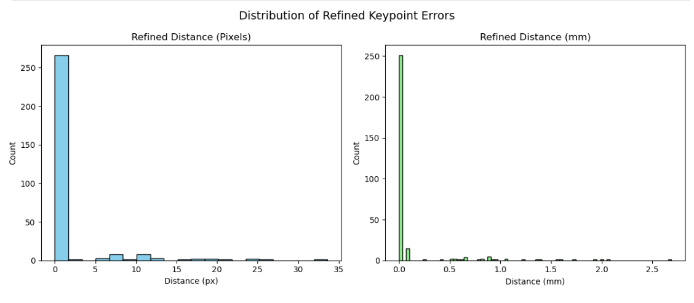 

## Evalueringsmetoder

Til evaluering af modellen har vi benyttet os af tre metoder:

1. **Mean radial error (MRE)**
2. **Succesful detection rate (SDR)**
3. **Weighted Cohen’s kappa**

De er defineret som følger:

**Mean radial error**:

$$
MRE = \frac{\sum_{i=1}^N R_i}{N}
$$

Her er \$N\$ antallet af predikterede punkter, og \$R\_i\$ er den euklidiske afstand mellem ground truth og modellens punkt.

MRE giver os indsigt i, hvor tæt modellens forudsigelser i gennemsnit ligger på det korrekte punkt (ground truth). Jo lavere MRE, desto mere præcis er modellens gennemsnitlige punktplacering.

**Succesful detection rate**:

$$
SDR = \frac{K}{N} \cdot 100
$$

Her er \$N\$ antallet af predikterede punkter, og \$K\$ er antallet af korrekt placerede punkter indenfor et tilladt "fejl"-interval. Vi har brugt intervaller, der tillader 0.5, 1 og 2 mm afstand i forhold til ground truth, hvor vi benytter den euclidiske afstnd.

SDR viser, hvor stor en andel af modellens forudsigelser der ligger indenfor et givent toleranceniveau fra ground truth (fx 0.5, 1 eller 2 mm). Det er særligt nyttigt, hvis man vil vide, hvor ofte modellen rammer “tilstrækkeligt tæt” på det korrekte punkt, givet at man accepterer en vis fejlmargin.

**Weighted Cohen’s kappa** (\$\kappa\_w\$) bruges til at måle, hvor god overensstemmelse der er mellem modellens klassifikation og den sande (ekspert-annoterede) klasse, hvor tilfældig overensstemmelse er korrigeret for:

$$
\kappa_w = 1 - \frac{\sum_{i,j} w_{i,j} O_{i,j}}{\sum_{i,j} w_{i,j} E_{i,j}}
$$

Her er \$O\_{i,j}\$ antallet af observationer, hvor annoteringen var klasse \$i\$ og modellen valgte klasse \$j\$, og \$E\_{i,j}\$ er den forventede andel af sådanne tilfælde udregnet ved (række*kolonne/total).

Vægtene \$w\_{i,j}\$ bruges til at straffe større fejl hårdere. Ved **kvadratisk vægtning** (“quadratic weights”) beregnes vægten som:

$$
w_{i,j} = \left( \frac{i - j}{k - 1} \right)^2
$$

hvor \$k\$ er antallet af klasser (her 5 for “A”–“E”).

Det vil sige, at hvis modellen forveksler “A” og “E”, tæller det som en større fejl end hvis den forveksler “A” og “B”.

---

## Resultater
Projektets resultater består primært af:

* CSV-filer med forudsigelser og målinger
* Visualiseringer i form af histogrammer
* Billeder med keypoints placeret af modellen

### Modeller og gemte filer

Der er blevet trænet en række modeller, som er placeret i mappen `Overbite/Other Versions (Overbite)/`.
Én af modellerne er udvalgt som den endelige, men flere af de øvrige modeller præsterer næsten lige så godt.

Ved afslutningen af træningen gemmes den valgte model som en `.pth`-fil, som anvendes sammen med biblioteket Detectron2.
Da filen overstiger GitHubs uploadgrænse, er den ikke inkluderet direkte i repositoryet. Der findes dog et link til filen i den relevante mappe.

### Keypoint-placering

I mappen `Overbite/Output/Keypoint Placement/` ligger filen `KP_Placement.csv`.
Denne indeholder både de sande (ground truth) og de forudsagte keypoints samt den euklidiske distance mellem disse målt i pixels og millimeter.

Eksempel på indhold:

| Filename              | X\_True | Y\_True | X\_Model | Y\_Model | Euc\_dist | mm\_dist |
| --------------------- | ------- | ------- | -------- | -------- | --------- | -------- |
| 013FHA7K\_lower\_left | 844     | 369     | 842.22   | 368.63   | 1.82      | 0.15     |

### Fordeling over afstanden

Nedenfor vises histogrammer over de euklidiske afstande mellem modelens forudsigelser og de sande punkter (ground truth).

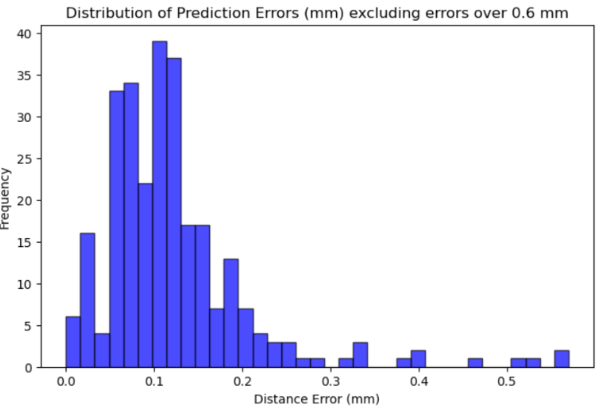

> Uden outliers > 0.6 mm. 276/300 Resultater.

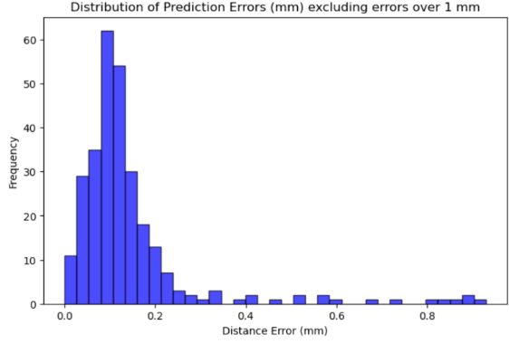

> Uden outliers > 1 mm. 285/300 Resultater.

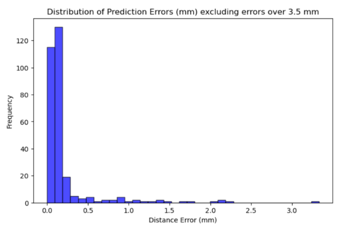

> Uden outliers > 3.5 mm. 300/300 Resultater.

### Statistik for y-værdier

Eftersom overbid måles ud fra de vertikale afstande mellem fortænderne, har vi fundet det relevant at udarbejde statistik for y-værdierne:

|Statistic | Value (pixels)| Value (mm)|
|------------------------|------|-----|
|Mean absolute difference|	1.18|	0.095|
|Mean difference|	0.53|	0.043|
|Median difference|	0.43|	0.035|
|Min difference|	-9.41|	-0.75|
|Max difference|	24.08|	1.93|

Vores model rammer i gennemsnit 1.18 pixels eller 0.095 mm fra den korrekte y-værdi. Den gennemsnitlige difference på 0.53 pixels (0.043 mm) indikerer, at modellen har en tendens til at placere keypointet lidt over den sande værdi. Både middel- og medianværdierne er små, hvilket tyder på en god præcision for langt de fleste punkter. Dog viser minimums- og maksimumsværdierne, at der eksisterer enkelte outliers, hvor modellen afviger markant fra det korrekte resultat.

### Resultater efter pixel-matrix-søgning

Efter at have anvendt pixel-matrix-søgning opnås justerede keypoints. Afstanden mellem disse raffinerede keypoints og de sande værdier er målt i både pixels og millimeter og gemt i KP_Refinement_Distance.csv:

| Filename | X_Model  | Y_Model  | X_Refined  | Y_Refined | X_True | Y_True | Refined_Pixel_Dist| Refined_mm_Dist|
|----------------------------|-----|-----|-----|-----|-----|-----|-----|-----|
| 013FHA7K_lower_left   | 842| 368|843 | 369 | 844 |369 | 1 | 0.08 |


Nedenfor ses et histogram over fordelingen af den euklidiske afstand mellem ground truth og de raffinerede keypoints. Det fremgår tydeligt, at fejlen er reduceret markant i forhold til modellens oprindelige forudsigelser.

 

### Statistik for y-værdier efter pixel-matrix-søgning

Efter anvendelse af pixel-matrix-søgning er der udarbejdet følgende statistik for forskellene i y-koordinater mellem de justerede keypoints og de korrekte (ground truth) værdier:

|Statistic | Value (pixels)| Value (mm)|
|------------------------|------|-----|
|Mean absolute difference|	0.457|	0.037|
|Mean difference|	0.03|	0.0024|
|Median difference|	0.0|	0.0|
|Min difference|	-9.0|	-0.72|
|Max difference|	20.0|	1.60|

Efter pixel-søgningen er modellens absolutte gennemsnitlige afvigelse reduceret til 0.457 pixels, svarende til 0.037 mm fra den korrekte y-værdi. Den gennemsnitlige forskel ligger nu på 0.03, hvilket indikerer, at modellen kun i meget begrænset omfang overskyder y-værdien.
Både medianen og middelværdien for forskellene er faldet markant sammenlignet med før pixel-søgningen, hvilket illustrerer en tydelig forbedring i modellens præcision. Selvom der stadig findes enkelte outliers, er både minimums- og maksimumafvigelserne blevet mindre, hvilket viser, at de mest ekstreme fejl er reduceret.

Outputtet fra pixel matrixen kan findes i mappen **Pixel Matrix/Image Output**. Her er det muligt at downloade enhver html fil, åbne den i sin browser og interagere med visualiseringen. 

<table>
  <tr>
    <td>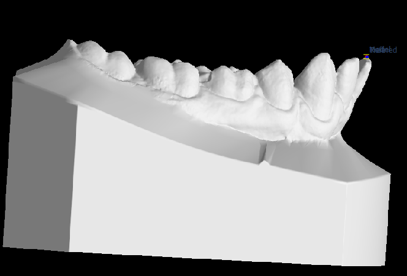</td>
    <td>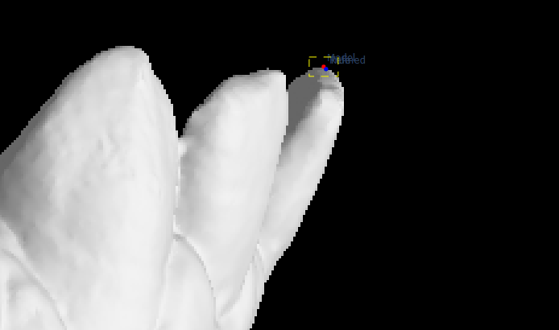</td>
    <td></td>
  </tr>
</table>

>  Rød: model punkt, grøn: ground truth punkt, blå: refined punkt og gul: søgefelt (I overstående figur er der overlap mellem grøn og blå, og derfor er kun den ene synlig):

### Test med simulerede CSV-filer
Til sidst er modellen blevet testet på simulerede CSV-filer. Hver fil repræsenterer 75 patienter, hvor en vertikal translate key er angivet for hver patient. Denne nøgle bruges til at justere overkæben vertikalt, så både over- og underkæbe bringes ind i samme koordinatsystem og danner et “bid”.
Disse translate keys er udarbejdet af vores vejledere og sikrer, at hvert tandsæt i testdata har en bestemt grad af overbid. Vi har modtaget 10 af disse simulerede CSV-filer, som gør det muligt at evaluere modellen i en simuleret virkelighed. Hvis en patients overbid ligger på grænsen mellem to klasser, så klassificeres patienten med klassen None og bliver ekskluderet fra testen.
Ved brug af de evalueringsmetoder, der er beskrevet i det foregående afsnit, har vi opnået følgende resultater for de 10 tests:


#### Detection Metrics (gælder for alle tests)


#### Før pixel-matrix-søgning
| SDR (≤ 0.5 mm) | SDR (≤ 1 mm) | SDR (≤ 2 mm) | Mean Radial Error (MRE) |
|----------------|--------------|--------------|--------------------------|
| 91 %           | 95.00 %      | 98.33 %      | 0.22 mm                  |


#### Efter pixel-matrix-søgning
| SDR (≤ 0.5 mm) | SDR (≤ 1 mm) | SDR (≤ 2 mm) | Mean Radial Error (MRE) |
|----------------|--------------|--------------|--------------------------|
| 89.33 %        | 96.00 %      | 99.00 %      | 0.12 mm                  |

#### Test Results

| Summary Name                | Classification Accuracy | Weighted Cohen's Kappa | Patients Total | Patients Excluded |
|----------------------------|--------------------------|------------------------|----------------|-------------------|
| Overbite_Classification1.csv | 97.22 %                 | 0.9927                 | 75             | 3                 |
| Overbite_Classification2.csv | 94.44 %                 | 0.9841                 | 75             | 3                 |
| Overbite_Classification3.csv | 95.89 %                 | 0.9906                 | 75             | 2                 |
| Overbite_Classification4.csv | 95.83 %                 | 0.9906                 | 75             | 3                 |
| Overbite_Classification5.csv | 94.59 %                 | 0.9860                 | 75             | 1                 |
| Overbite_Classification6.csv | 94.59 %                 | 0.9875                 | 75             | 1                 |
| Overbite_Classification7.csv | 95.89 %                 | 0.9894                 | 75             | 2                 |
| Overbite_Classification8.csv | 94.52 %                 | 0.9882                 | 75             | 2                 |
| Overbite_Classification9.csv | 97.30 %                 | 0.9935                 | 75             | 1                 |
| Overbite_Classification10.csv| 93.15 %                 | 0.9836                 | 75             | 2                 |

## Pipeline
Som den sidste del af projektet er der udviklet en pipeline, der tager to PLY-filer — én for overkæben og én for underkæben — som input. Pipelinen giver som output en visuel forudsigelse af det samlede tandsæt samt en klassifikation af overbid.

Den første version af pipelinen byggede på kode, som vores vejleder havde stillet til rådighed, oprindeligt udviklet af en postdoc. Denne kode accepterede én enkelt PLY-fil og genererede to billeder: ét, der viste tænderne fra venstre side, og ét fra højre side.

Vi udvidede og ændrede koden, så den nu tager to PLY-filer (over- og underkæbe) som input. Vores tilføjelser omfatter:

• Justering og ensretning af billederne

• Kørsel af modellen til overbidsklassifikation

• Fremstilling af et endeligt output, der viser både de forudsagte keypoints og klassifikationsresultatet

På nuværende tidspunkt kan vi ikke evaluere pipelinens ydeevne på virkelige eksempler. For at pipelinen kan give nøjagtige forudsigelser, skal både over- og underkæbemodellerne være i samme koordinatsystem. Denne justering findes dog ikke i de PLY-filer, vi har til rådighed.


## Referencer 

Data:
Ben-Hamadou, Achraf, Neifar, Nour, Rekik, Ahmed, Smaoui, Oussama, Bouzguenda, Firas, Pujades, Sergi, Boyer, Edmond, and Ladroit, Edouard. "Teeth3Ds+: An Extended Benchmark for Intra-oral 3D Scans Analysis." arXiv preprint arXiv:2210.06094 (2022). https://arxiv.org/abs/2210.06094

