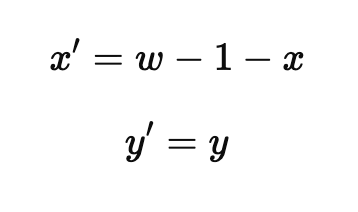

# Overbidsklassificering — Automatisering og Standardisering  
*Et maskinlæringsprojekt til klassificering af overbid ud fra 3D-scanninger og billeder.*

---

## Table of Contents

- [Quick Overview](#quick-overview)
- [Projektbeskrivelse](#projektbeskrivelse)
  - [Abstract](#abstract)
  - [Introduktion](#introduktion)
  - [Data og Databehandling](#data-og-databehandling)
    - [Databehandling](#databehandling)
    - [Data](#data)
  - [CNN-netværk](#cnn-netværk)
  - [Resultater](#resultater)
  - [Pipeline](#pipeline)
- [Folder Structure](#folder-structure)
---

## Quick Overview

- **Data:** Indeholder alle rå og forarbejdede CSV- og PNG-filer, primært brugt til træning og test.
- **Overbite:** Indeholder kode, scripts, outputs og forskellige versioner brugt til overbite-klassificering.
- **Pipeline:** Viser hele workflowet fra 3D .PLY-fil til keypoint-placering.

---

## Folder Structure

Data/\
│\
├── Clean Data/\
│ ├── Bolton Data/ # Billeder til Bolton-analyse\
│ └── Overbite Data/ # Billeder til overbite-detektion\
│ ├── Annotated Data Pairs/ # Træningsdata med annotationer\
│ ├── Annotated Data Verication Pairs/ # Verifikationsdata\
│ ├── Unannotated Data Pairs/ # Uannoterede billeder\
│ └── Annotated Data Test Pairs/ # Testdata efter træning\
│\
├── Raw Data/\
│ └── Sample images/ # De originale billeder\
│ └── Labels as of 28-02-2025 (FINAL - for now) # Den originale CSV fil\
└── Splitting_and_flipping_of_images.ipynb # Notebook til dataprocessering\

Overbite/\
│\
├── Kode/ # Kode til træning og test\
├── Output/ # Output fra model (billeder, csv, plots)\
└── Other Versions/ # Alternative modeller og outputs\

Pipeline/\
│\
├── Pipeline_code/ # Python scripts brugt i pipeline\
├── Pipeline_data/ # .PLY, PNG og outputfiler\
└── dock/ # Yderligere pipeline-relaterede data\

---

# Projektbeskrivelse

## Indholdsfortegnelse

- Abstract
- Introduktion
- Data og databehandling
- CNN-netværk
- Resultater
- Pipeline

---

## Abstract

*Automatisering og standardisering af overbidsklassificering gennem maskinlæring og billedbehandling.*

---

## Introduktion

I tandlægepraksis findes der ikke én standardiseret metode til måling af overbid. Nogle anvender øjemål, andre lineal, røntgenbilleder eller 3D-scanninger. Alle metoder har fordele og ulemper, men ofte er der en afvejning mellem præcision og tidsforbrug.

**Dette projekt har to hovedfokusområder:**

1. Udvikling og træning af maskinlæringsmodeller til præcis overbidsklassificering.
2. Udarbejdelse af en pipeline, der går fra 3D-filer (.PLY) til keypoint-markering, der muliggør automatisk måling.

**Bemærk:** Resten af denne projektbeskrivelse omhandler kun punkt 1. Pipeline beskrives separat i sektionen "Pipeline".

---

## Data og Databehandling

### Databehandling

Projektet startede med **1351 kombinerede billeder** (3 vinkler pr. patient):

> *Billede af underkæbe fra 3 vinkler*

Til billederne var der **1166 annoteringer**, eksempelvis:

| Filename                       | X1  | Y1  | X2   | Y2  |
|---------------------------------|-----|-----|------|-----|
| 00OMSZGW_lower_combined.png     | 777 | 492 | 2310 | 487 |

#### Mål for databehandling:

1. Split kombinerede billeder til tre separate billeder (left, middle, right)
2. Fordel billeder i mapper: **Bolton Data** og **Overbite Data**
3. Ensret orientering og koordinationer i "Overbite Data" (ved transponering)
4. Gruppér data som billed-par
5. Del data i træning, test, verifikation, og uannoteret data

#### Step 1: Splitting

#### Step 2: Sortering

- **Left/Right** billeder → *Overbite Data*
- **Middle** billede → *Bolton Data*

#### Step 3: Ensretning

"Left" billedet transponeres (flippes), så orienteringen matcher "right" billedet, og koordinater justeres:

Eksempel:

| Filename                   | X1  | Y1  |
|----------------------------|-----|-----|
| 00OMSZGW_lower_right.png   | 777 | 492 |
| 00OMSZGW_lower_left.png    | 761 | 487 |

Her er `X2=2310` fra originalen blevet til `X1=761` i det flippede billede.  
Formel:  
`x' = w - 1 - x`, hvor `w=3072`, `x=2310`  
`x' = 3072 - 1 - 2310 = 761`

#### Step 4 + 5: Par og grupper

- Et *par* = 4 billeder med koordinater (left/right, upper/lower)
- Ufuldstændige par → *Unannotated Data Pairs*
- Resten inddeles i:
    - *Annotated Data Pairs* (træning)
    - *Annotated Verication data* (verifikation under træning)
    - *Annotated Test data* (test efter træning)

> Outliers og fejl rettes i CSV efter databehandling.  
> Alt databehandling findes i `Splitting_and_flipping_of_images.ipynb`.

---

### Data

Oversigt over fordelingen af billeder:

| Folder                               | Image count | Patient count |
|---------------------------------------|-------------|-------------|
| Bolton Data                          | 1351        | 675 |
| Overbite Data                        | 2702        | 675 |
| Overbite Data/Annotated Data Pairs   | 1580        | 395 |
| Overbite Data/Annotated Verication data | 100      | 25 |
| Overbite Data/Annotated Test data    | 300         | 75 |
| Overbite Data/Unannotated Data Pairs | 722         | 180 |

Deskriptiv statistik

| Folder                              |
|---------------------------------------|
| Overbite Data/Annotated Data Pairs   |
    Klasse A:
    Klasse B:
    Klasse C:
    Klasse D:
    Klasse E:
| Overbite Data/Annotated Verication data |
| Overbite Data/Annotated Test data    |

---

<!-- Placeholder: Her kan du indsætte flere afsnit om CNN-arkitektur, resultater, pipeline osv. hvis du ønsker det senere! -->

---

